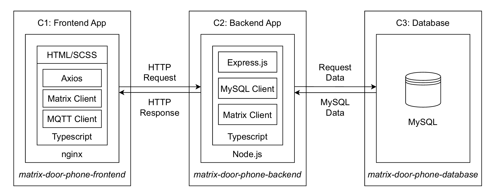
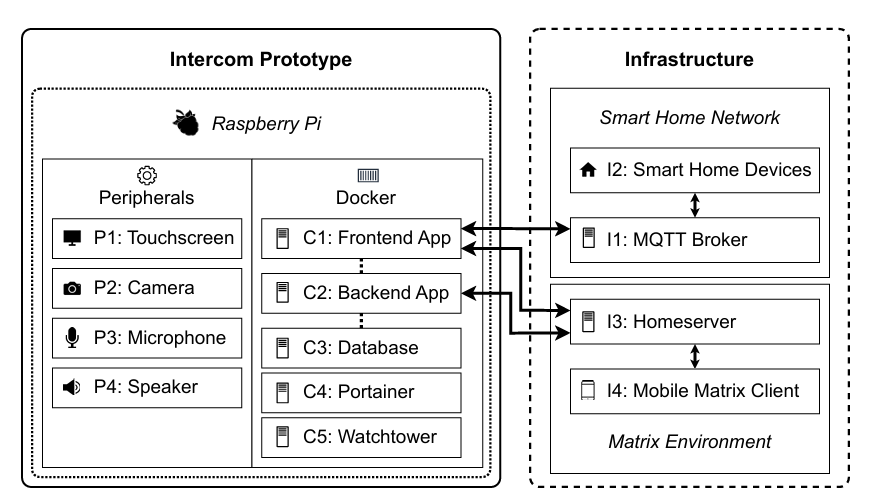
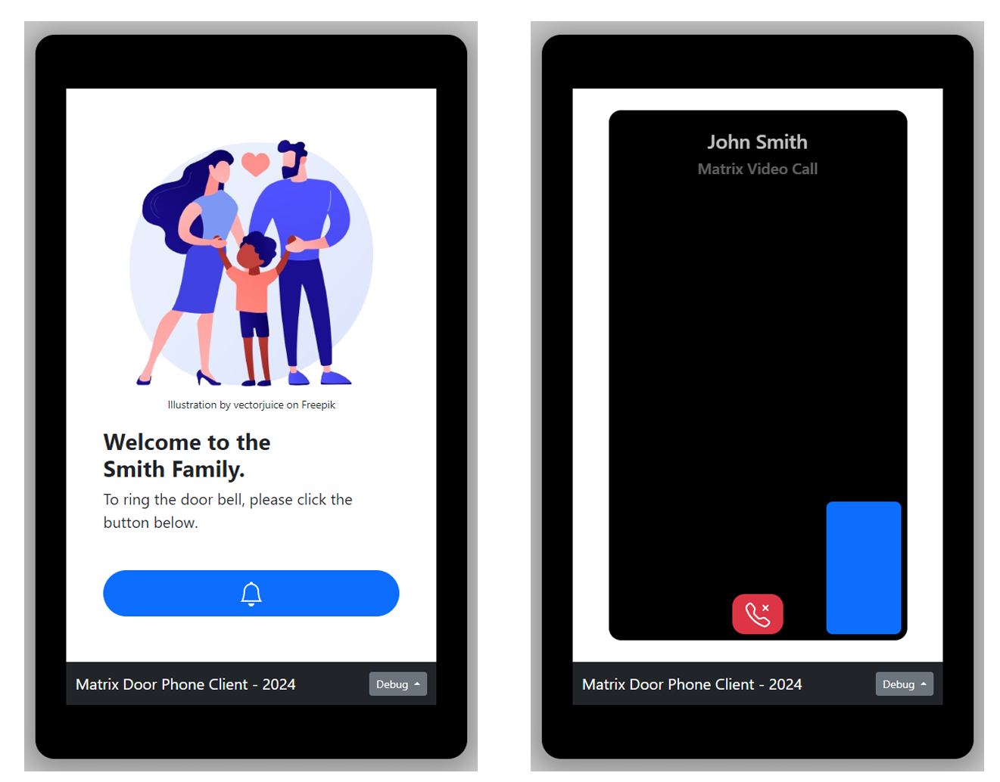
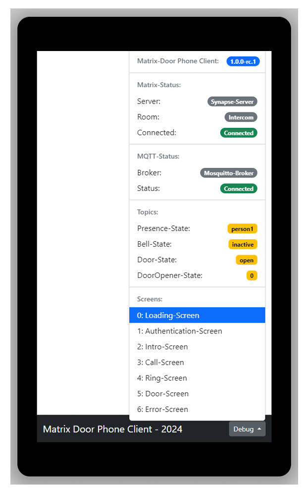
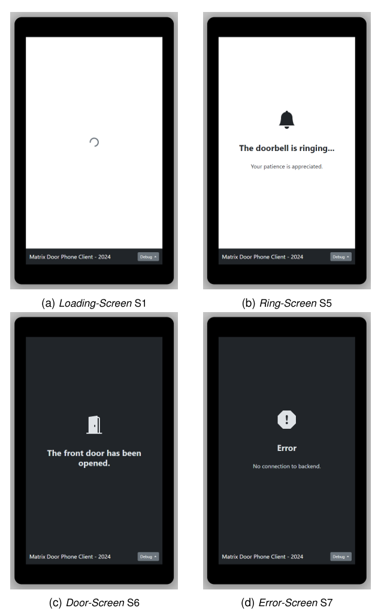
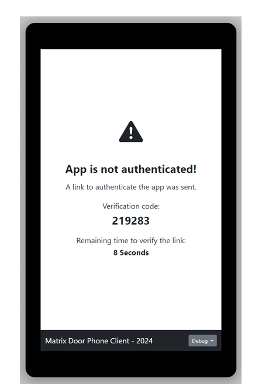
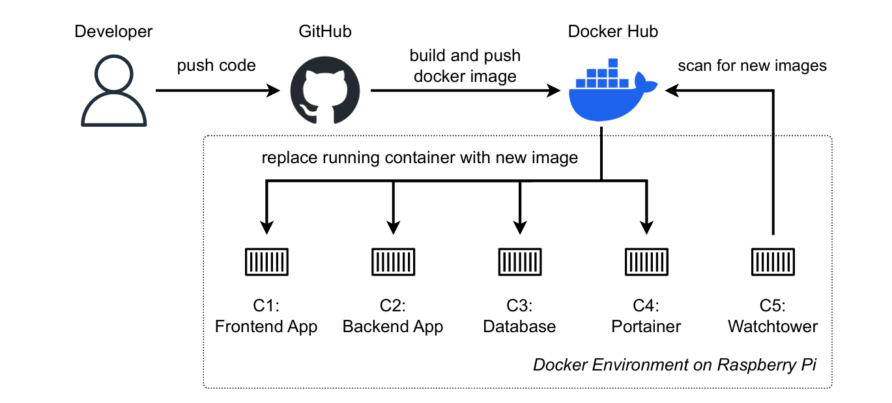

# Matrix-Door-Phone

**Matrix-Door-Phone** is a prototype implementation of a web-based video intercom system, developed as part of **my master thesis**. The objective was to evaluate whether the open communication protocols **Matrix** and **MQTT** can be used in combination with a **Raspberry Pi 4** to implement a smart home-compatible video doorbell. The system aims to provide similar functionality to commercial solutions such as Ring, but with the addition of **bidirectional video communication** and **smart home integration** using open standards.

## Technologies

  
  
  
  
  
  
  
  
  

## Implementation

The system is composed of three main components:

- **Frontend App** (`matrix-door-phone-frontend`)  
  A web-based interface built with **TypeScript**, styled using **Bootstrap** and SCSS. It uses **Axios** for API communication, a **Matrix client** for message handling, and an **MQTT client** for real-time updates. The frontend is served via **nginx**.

- **Backend App** (`matrix-door-phone-backend`)  
  Built with **Node.js** and **Express.js**, the backend handles RESTful API endpoints, communicates with the Matrix homeserver, manages MQTT events, and accesses the database.

- **Database** (`matrix-door-phone-database`)  
  A **MySQL** database that stores device states, configurations, and communication metadata.

## System Architecture

The software stack runs on a **Raspberry Pi 4** and is fully containerized using Docker. The system includes a frontend, backend, database, and additional services for maintenance and monitoring. Peripherals such as camera, microphone, speaker, and touchscreen are directly connected to the Pi.

## Containerization

The complete system is containerized using **Docker**. Each component (frontend, backend, database) runs in its own container and can be orchestrated via a `docker-compose.yml` file. This allows for reproducible deployments and simplified development and testing.

## Performance Evaluation

To assess the feasibility of the Raspberry Pi as a deployment platform, the system's **CPU, memory usage, and power consumption** were monitored under different usage conditions using:

- **Telegraf (InfluxData)**: to monitor system resource consumption during idle and call states.
- **Shelly Pro 3 EM**: to measure electrical power consumption in multiple test scenarios (day/night, idle, active, 24h cycle).

The results were compared to those of a commercial Ring doorbell to evaluate overall efficiency and performance.

## User Interface

The Matrix Door Phone Client features a modern, touch-optimized interface designed for wall-mounted operation. The welcome screen includes a bell icon for visitors and optionally displays a family or household name. Upon interaction, the system initiates a Matrix-based video call.

The debug interface provides insight into the system state, including the Matrix and MQTT connection status, the active room and broker, as well as live topic values such as doorbell state or presence detection.

Multiple screens are defined to represent the full interaction flow:
- Loading Screen
- Authentication Screen
- Intro Screen
- Call Screen
- Ring Screen
- Door Opened Screen
- Error Screen

These screens allow dynamic feedback and stepwise interaction control for both users and system events.

---

## Authentication Flow

During system startup or device reset, the application requires authentication via Matrix. A verification code is displayed together with a time limit, and a login link is sent via the Matrix network.

---

## CI/CD and Deployment

The system uses a container-based CI/CD pipeline. Code is pushed to GitHub, where it triggers Docker image builds and deployments to Docker Hub. Watchtower on the Raspberry Pi automatically pulls and replaces containers once new images are available. This setup allows unattended and stable updates in the field.

